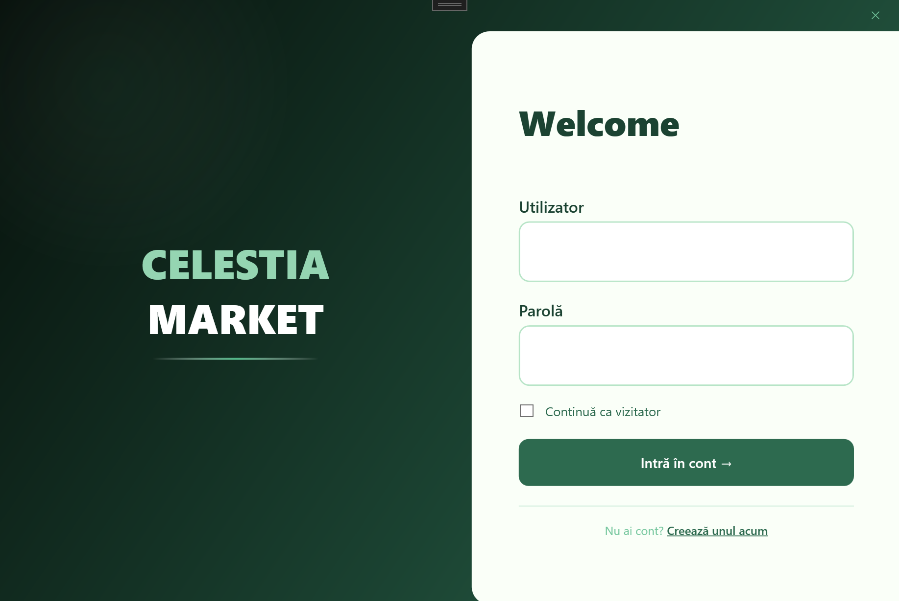
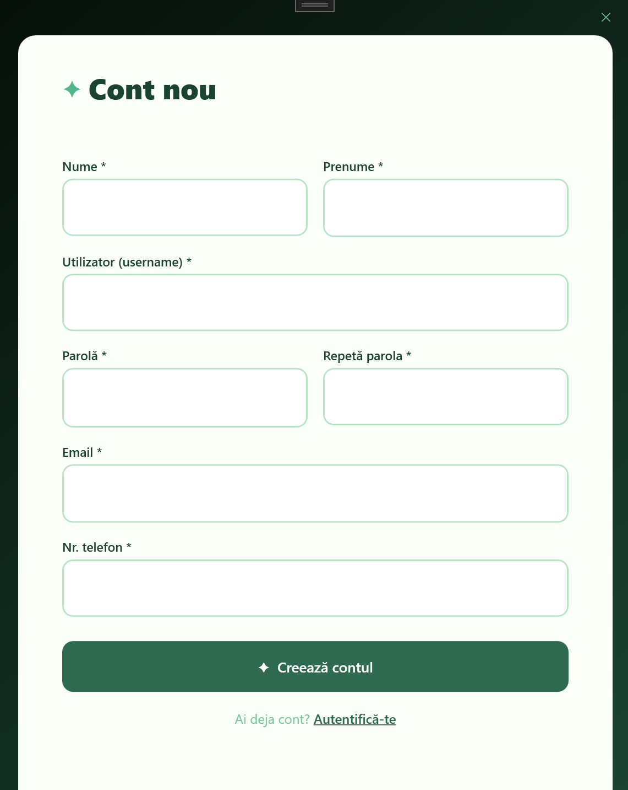
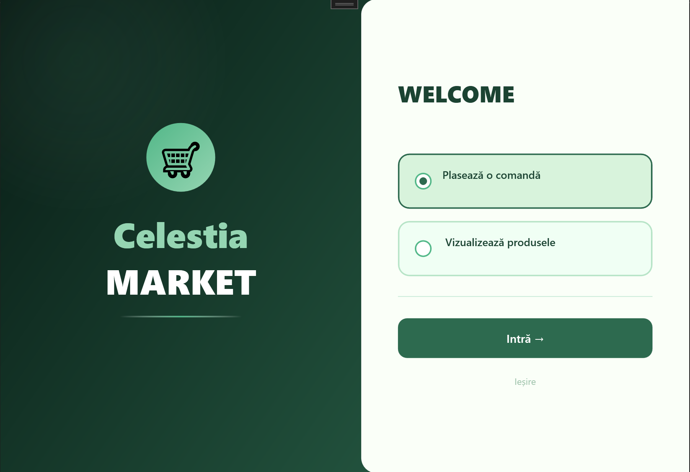
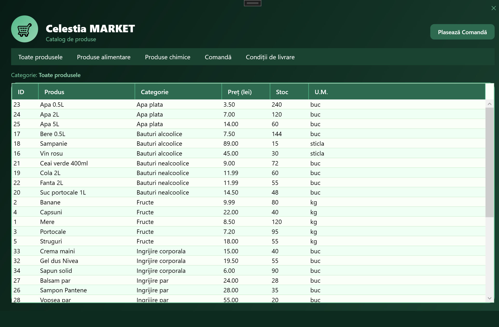
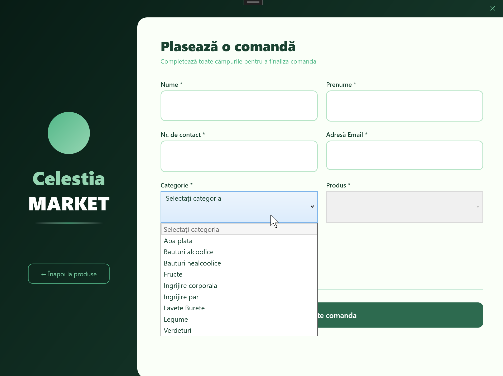

# Celestia MARKET

Aplicație WPF de tip magazin dezvoltată în C# cu bază de date mysql

## screenshots

### autentificare

### inregistrare

### Welcome

### Catalog produse

### Catalog - selectam fructe din meniu

### Plasare comandă

## Tehnologii folosite
- C# / WPF (.NET)
- mysql xampp

## Cum rulezi proiectul
1. Pornește XAMPP și activează MySQL
2. Importă `market.sql` în phpMyAdmin
3. Deschide soluția în Visual Studio
4. Rulează proiectul (F5)